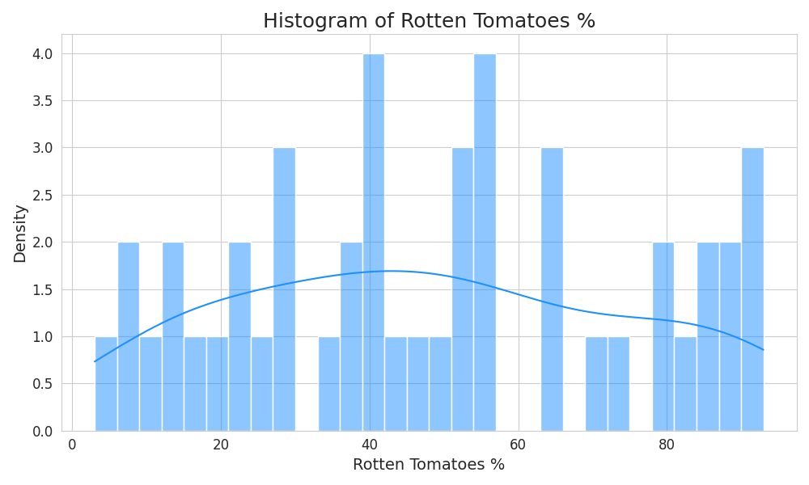

# Movie Dataset Summary

## Summary Statistics
|       |   Audience score % |   Profitability |   Rotten Tomatoes % |       Year |
|:------|-------------------:|----------------:|--------------------:|-----------:|
| count |            46      |        46       |             46      |   46       |
| mean  |            64.1957 |         5.13884 |             48.3261 | 2009.07    |
| std   |            13.0718 |        10.0385  |             26.6192 |    1.43608 |
| min   |            40      |         0       |              3      | 2007       |
| 25%   |            52.5    |         1.8583  |             27.25   | 2008       |
| 50%   |            62.5    |         2.64084 |             46.5    | 2009       |
| 75%   |            76      |         4.97704 |             69.5    | 2010       |
| max   |            89      |        66.934   |             93      | 2011       |

